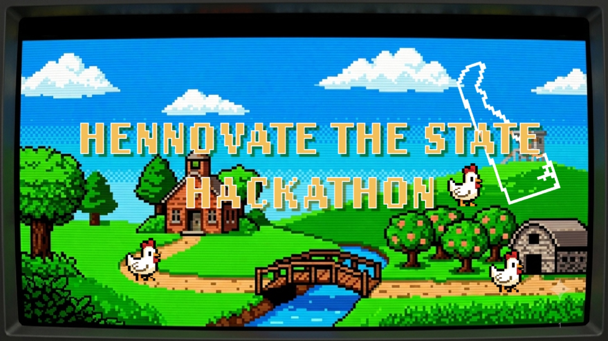

# Hennovate
This repository is the central hub for the NSF DARSE, FSAII, The State of Delaware Hackathon. Hennovate - 2026

  

## Purpose
This repository contains links to all case study repositories and final presentations slides

## Case Studies

| Case Study | Partner | Repository | Slides |
|-----------|---------|------------|---------|
| Emergent - An AI-powered abnormal event notification system that intelligently classifies and routes events, generates employee infographics and executive summaries, and enables human-in-the-loop approval for safe and high risk communication. | State of Delaware Department of Finance | https://github.com/NSF-DARSE/emola | [View PDF](slides/303-deptFinance-emergent.pdf) |
| Analyze historical transportation asset condition and inspection data (bridge and pavement tracks) to predict future deterioration and support proactive maintenance and inspection prioritization. | DELDOT maintenance team | https://github.com/NSF-DARSE/DelDot-Predictive-Asset-maintenance-2026 |  [View PDF](slides/306-deldot-maintenance-team.pdf) |
| Hourly traffic volume forecasting for 118 anonymous monitoring stations across Delaware's road network, with calibrated uncertainty, scenario analysis, and a deployed operational assistant. | DELDOT Traffic Team | https://github.com/NSF-DARSE/DelDot-Traffic-Team | [View PDF](slides/306-deldot-traffic-team.pdf) |
| A first pass over a septic permit application | DNREC | https://github.com/NSF-DARSE/dnrec-septic-precheck |
| AI-powered pipeline to scrape Delaware arts & culture events from government websites | Division of ARTS | https://github.com/NSF-DARSE/division-of-arts | [View PDF](slides/328-division-of-arts-team.pdf)
| DCSS OWLS is a secure, source-grounded AI assistant that helps Delaware child support employees quickly find, understand, and verify approved policies, procedures, and guidance | Department of Child Support Services | https://github.com/NSF-DARSE/dcss-owls | [View PDF](slides/401-dcss-team.pdf)
| AI-powered Delaware Courts platform that helps the public navigate official court information while enabling staff to monitor and improve website content through intelligent auditing and analytics. | Courts | https://github.com/NSF-DARSE/DOC-CourtBot5000 | [View PDF](slides/402-dept-of-courts-team.pdf) |
| Develop an evidence-grounded AI solution that reviews transportation contract packages against the supplied reference checklist and identifies missing, modified, conflicting, outdated, or non-standard provisions for human review. | DELDOT Contract Team | https://github.com/NSF-DARSE/Deldot-Contract-team |  [View PDF](slides/520-division-of-labor-team.pdf) |
| Out-of-State Tag Holder Challenge | DELDOT DMV team |  https://github.com/NSF-DARSE/Deldot-DMV-team | [Vew PDF](slides/514-deldot-dmv-team.pdf) |
| An AI pipeline that reads scattered partner websites and turns them into one clean, trustworthy calendar | Division of Labor | https://github.com/NSF-DARSE/DivisionOfLaborTeam | [View PDF](slides/520-division-of-labor-team.pdf)
